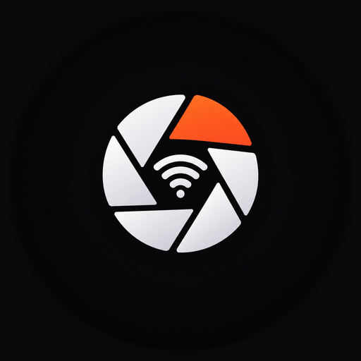

# SonnyLink

> 用 Android 手机通过 Wi-Fi 遥控老款索尼相机：实时取景 + 遥控拍摄 + 浏览下载卡内照片。
>
> **轻量、低延迟、省电。** 专为 PMCA 时代（2015 前后）的索尼微单/黑卡设计。



---

## 免责声明

**这是第三方非官方软件，与索尼公司（Sony Corporation）无任何关联、未获其授权或认可。**

本项目通过分析相机公开的网络接口实现功能，仅供用户连接**自己拥有**的相机使用。
"SONY"、"ILCE" 等商标归其各自所有者所有。

---

## 为什么做这个

索尼官方 App（Imaging Edge Mobile / 旧版 PlayMemories Mobile）在这些老机型上有几个问题：

- 取景占用高，手机发烫、耗电快
- 无法传输 **RAW** 和**视频**（相机限制）

SonnyLink 只做这几件事，把它们做快、做稳。

---

## 功能

### 📷 遥控监看

- **实时取景**：640×424 @ 15~20fps，端到端延迟约 100ms
- **GPU 渲染**：OpenGL ES 双三次插值放大 + USM 锐化，单 pass
- **遥控拍摄**：快门按钮，拍摄后自动取回预览图
- **曝光补偿**：−5 ~ +5 EV，1/3 档
- **自拍定时**：0s / 2s
- **常驻 HUD**：光圈、ISO、快门、曝光模式始终可见
- **自动横竖屏**、画面填满屏幕

### 🖼 传输照片

- **DLNA 浏览**：自动读取卡内所有照片，**按拍摄日期分组**
- **下载原图**：JPEG 全尺寸原图（如 6000×4000），保存到系统相册或自选目录
- **并发下载**：默认 3 路，可调 1/6，带实时速度显示


### 性能

| 指标 | 遥控模式 | 相册模式 |
|---|---|---|
| 内存 PSS | **155 MB**（Native 堆仅 13 MB） | **172 MB**，稳定不增长 |
| CPU | **< 0.5%**（对比 surfaceflinger 18%） | — |
| 帧渲染 | 中位 **8ms**，120Hz 满帧，**0 次错过垂直同步** | 同左 |
| 安装包 | **2.55 MB**（R8 混淆 + 资源压缩） | — |

实测机型：Redmi / Android 17 / 1080×2400 @120Hz。

### 🔊 省电

取景时**自动把屏幕刷新率降到 60Hz** —— 取景流只有 17fps，屏幕跑 120Hz 只是把同一帧多刷 53 次。
平时（菜单/相册）用屏幕支持的最高刷新率。

---

## 系统要求

- **Android 10（API 29）及以上**
- 相机需支持索尼 **Camera Remote API**（PMCA 时代机型）

### 已验证机型

| 机型 | 遥控 | 传照片 |
|---|---|---|
| **Sony ILCE-6300 (a6300)** | ✅ 完整验证 | ✅ 完整验证 |
| 其他 ILCE / DSC / HDR 机型 | 理论兼容，欢迎反馈 | 理论兼容 |

---

## 安装

从 [Releases](../../releases) 下载 APK 直接安装。

> 首次启动会申请「附近的 Wi-Fi 设备」权限 —— 用于读取当前 Wi-Fi 名称以判断连的是不是相机热点。

---

## 使用

相机**一次只能运行一种模式**，所以 App 里先选。

### 遥控监看

1. 相机 → 菜单 → **应用程序** → **嵌入式智能遥控**
2. 相机屏幕会显示 SSID 和密码，保持这个界面不要退出
3. 手机系统设置里连接相机的 `DIRECT-xxxx:ILCE-xxxx` 热点
   （系统提示「无法访问互联网」是**正常的**，相机热点不提供上网）
4. 回到 SonnyLink → **遥控监看** → App 会自动检测并连接

### 传输照片

1. 相机 → 菜单 → **应用程序** → **发送到智能手机**
2. 手机连接相机热点
3. SonnyLink → **传输照片** → 自动进入，按日期分组的照片列表

---

## 构建

需要 **JDK 17** 和 Android SDK（compileSdk 36）。

```bash
# 单元测试（49 个）
./gradlew :core-protocol:test :core-liveview:test :core-dlna:test

# Debug 包
./gradlew :app:assembleDebug

# Release 包（需要签名配置，见下）
./gradlew :app:assembleRelease
```

### 发布签名

把 `keystore.properties.example` 复制成 `keystore.properties` 并填入你的密钥信息：

```properties
storeFile=keystore/your.jks
storePassword=...
keyAlias=...
keyPassword=...
```

没有这个文件也能构建 —— release 包只是不会签名。

---

## 架构

```
core-protocol/     纯 Kotlin：索尼 ScalarWebAPI 协议层（JSON-RPC over HTTP）
  SonyJsonRpcClient     HTTP 通道
  SonyCameraApi         固件方法 + 能力缓存
  DeviceDescription     解析 DD.xml
  CameraEvent           解析 getEvent 推送
  SonyJson              带 BOM 容错的 JSON 工具

core-liveview/     纯 Kotlin：取景流解析
  SonyLiveviewDecoder   136 字节头 + JPEG 负载
  JpegInfo              SOI/EOI 扫描

core-dlna/         纯 Kotlin：DLNA / UPnP
  DidlParser            DIDL-Lite 解析（含 XML 反转义）
  SoapMessages          SOAP 报文构造
  SsdpMessages          SSDP 发现

app/
  camera/         网络绑定、仓库层、DLNA 客户端
  gallery/        相册仓库 + ViewModel
  liveview/       GLES 渲染 + 取景管线
  ui/             Compose 界面
```

**三个 core 模块是纯 Kotlin（不依赖 Android），可以独立跑 JVM 单元测试** —— 共 49 个测试。

---

## 技术要点

实现过程中的关键技术细节，供二次开发参考。

### 取景流

- 响应是 `Transfer-Encoding: chunked`。用 `HttpURLConnection` 会**丢掉 chunk 分帧**，必须用裸 socket 保留，否则解析错位。
- 每帧 = **8 字节公共头 + 128 字节负载头 = 136 字节**，后面才是 JPEG。
- 魔数 `0x24356879`（`"$5hy"`），负载长度在偏移 12，3 字节大端。
- **`payloadSize` 是相机缓冲区大小，不是 JPEG 长度** —— EOI 后面还有 49~79 字节陈旧数据，必须自己扫 SOI/EOI。

### 能力探测

- `getAvailableApiList` **不可靠**：M 档下不返回 `setExposureCompensation`，但调用其实成功。
- 正确做法：**写操作直接调用，让相机当权威**；UI 可见性用**语义信号**，绝不用方法名列表。

### DLNA

- `<Result>` 里的 DIDL-Lite 是 **XML 转义的**，必须先反转义（`&amp;` 放最后），否则一个条目都解析不出来。
- 资源命名：`ORG_` 原文件 / `LRG_` 大预览 / `SM_` 小预览 / `TN_` 缩略图。
- **RAW 没有 `ORG_`**，只有转码预览；请求 `ORG_*.ARW` 返回 **HTTP 406**。
- **视频完全不提供**。

### 网络

- 相机热点没有互联网，必须做**句柄级绑定**（`network.openConnection()`），不要用 `bindProcessToNetwork()`。
- **判断「连着的是不是相机热点」要用 `NET_CAPABILITY_VALIDATED`，不是 `NET_CAPABILITY_INTERNET`** —— 实测相机热点的能力位带 `INTERNET` 但没有 `VALIDATED`。
- 不要用 `WifiManager.connectionInfo` 判断是否已连接：Android 10+ 缺定位权限时 `networkId` 恒为 `-1`。

### 性能

- **`LruCache` 必须重写 `sizeOf`**。默认每个条目算 1，传 `24 * 1024 * 1024` 会被当成 2400 万条目的上限 —— **永不淘汰**，内存只涨不降。
- 缩略图解码要**先探尺寸再按 `inSampleSize` 降采样**。直接 `decodeStream` 会按原尺寸解成 ARGB_8888，一张大预览就是 7 MB。
- 相册滚动卡顿常常是**「图没到位」**而不是「画不出来」—— 用 `adb shell dumpsys gfxinfo` 看帧耗时才能区分。

更多细节见 [docs/camera-profiles/ILCE-6300.md](docs/camera-profiles/ILCE-6300.md)。

---

## 已知限制

这些是**相机本身的限制**，不是 App 的 bug：

| 限制 | 说明 |
|---|---|
| **不能传 RAW 原文件** | 相机 DLNA 只提供转码 JPEG，请求 `.ARW` 返回 406。可下载预览图作为替代 |
| **不能传视频** | `GetProtocolInfo` 只声明 JPEG，视频没有 DLNA 资源 |
| **不能触摸对焦** | 固件不支持（官方 App 同样不行） |
| **不能拍视频** | `setShootMode(["movie"])` 返回错误 500 |
| **取景固定 640×424** | 相机只提供这一个规格 |
| **缩略图约 0.7 秒/张** | 相机端处理慢，不是带宽问题。已用并发 + 缓存掩盖 |

---

## 贡献

欢迎提交 Issue 和 PR。如果验证了其他机型，欢迎补充 `docs/camera-profiles/`。

---

## 许可

[MIT](LICENSE)

---

## 致谢

- 协议参考：[Sony Camera Remote API beta](https://developer.sony.com/) 公开文档
- 部分行为通过抓包与官方 App 对照验证
